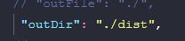

# config-typescript

## Descrição

Projeto default Typescript configurado.

## 0.1

npm init -y

### instale as dependencias
npm i
### instale as dependencias de desenvolvimento
npm i -D
### faça a configuração de build da aplicação
npx tsc --init
### crie o build da aplicação
npx tsc
### crie as configurações do EsLint
npx eslint --init
(OBS: regras são adicionadas conforme necessário na aplicação)
(
  OBS: adicione um '.eslintignore' com as configurações abaixo:
    /*.js
    node_modules
    dist
)

## 0.2

Em 'tsconfig.json' adicione o diretório onde será feito o build.
configuração: outDir.

##

npm run dev
 - para rodar o servidor.

